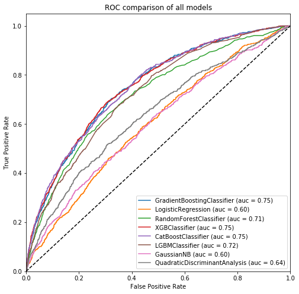
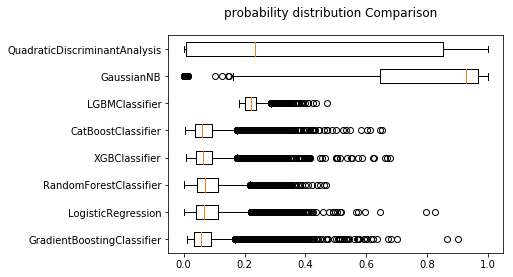
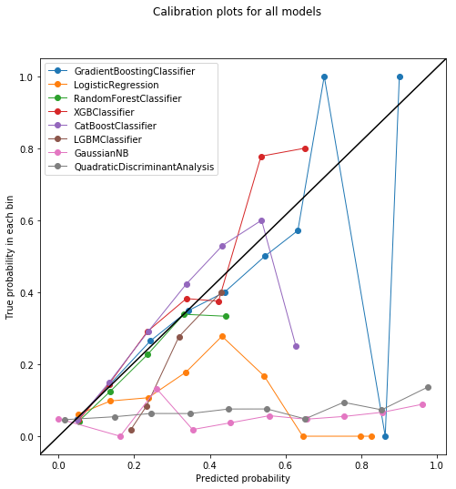
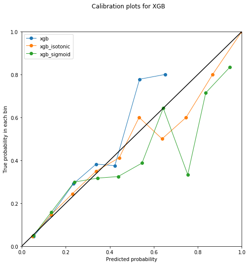
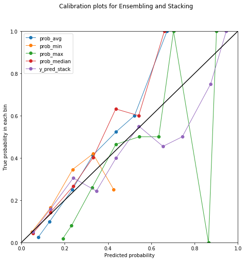

# Setup


```python
import numpy as np
import pandas as pd

from sklearn.model_selection import train_test_split, StratifiedKFold, learning_curve, RandomizedSearchCV,GridSearchCV
from sklearn.metrics import precision_score, recall_score, roc_auc_score, fbeta_score, roc_curve, auc, brier_score_loss
from sklearn.preprocessing import LabelEncoder
from sklearn.calibration import CalibratedClassifierCV, calibration_curve
from sklearn.preprocessing import MinMaxScaler

from sklearn.ensemble import GradientBoostingClassifier, RandomForestClassifier
from sklearn.linear_model import LogisticRegression
from sklearn.neighbors import KNeighborsClassifier
from xgboost.sklearn import XGBClassifier
from catboost import CatBoostClassifier
from lightgbm import LGBMClassifier
from sklearn.naive_bayes import GaussianNB
from sklearn.discriminant_analysis import QuadraticDiscriminantAnalysis
#from sklearn.svm import SVC

#from keras.wrappers.scikit_learn import KerasClassifier
#from keras.models import Sequential
#from keras.layers import Dense, Dropout, Activation
#import keras.backend as K
#from keras.optimizers import SGD, Adam

#from brew.base import Ensemble, EnsembleClassifier
#from brew.stacking.stacker import EnsembleStack, EnsembleStackClassifier
#from brew.combination.combiner import Combiner

from datetime import datetime

import matplotlib.pyplot as plt
%matplotlib inline

import warnings
warnings.filterwarnings("ignore")

```

# Data pre process


```python
dt_path = "../data/kdd2009/"
```


```python
#first 190 features are numerical and the last 40 are categorical
X = pd.read_table(dt_path+"orange_small_train.data")
X.shape
```


    (50000, 230)


## features transformation


```python
num_features = list(X.columns[:190])
cat_features = list(X.columns[190:230])
```


```python
empty_features = []
c = 0.3
for feat in X.columns:
    nulls = X[feat].isnull().value_counts()
    try:
        not_nulls = nulls[False]
        if not_nulls < c*40000:
            empty_features.append(feat)
    except:    
        empty_features.append(feat)
print ("number of empty features is", len(empty_features))
```

    number of empty features is 154


```python
#remove sparse features
for feat in empty_features:
    #data.drop(feat, axis = 1, inplace = True)    
    if feat in num_features:
        num_features.remove(feat)
    else:
        cat_features.remove(feat)
    X.drop(feat,axis=1, inplace=True)
```

## missing value imputation
X[num_features].fillna(0, axis=1, inplace=True)

```python
#Numeric features: replace missing values with (max value + 1).
maxs = X.max(axis = 0)
for i,feat in enumerate(num_features):
    fill_value = maxs[i] + 1.
    X.fillna({feat: fill_value}, inplace=True)
```


```python
#Categorial features: replace values with their frequencies.
data_cat_all = X[cat_features]

for feat in data_cat_all.columns:
    data_cat_all[feat] = data_cat_all[feat].map(data_cat_all.groupby(feat).size())
    
X[cat_features] = data_cat_all.loc[:39999,:]
```


```python
#Categorial features: replace missing values with zeros.
X.fillna(0., inplace=True)
```
X[cat_features] = X[cat_features].apply(lambda x:pd.factorize(x)[0])X[cat_features]=X[cat_features].astype('category')
## Load target valuable


```python
y = pd.read_table(dt_path+"orange_small_train_churn.labels",header=None)
y.shape
```


    (50000, 1)


```python
y = LabelEncoder().fit_transform(y)
```


```python
pd.Series(y).value_counts() 
```


    0    46328
    1     3672
    dtype: int64


## get data ready for training


```python
Scaler = MinMaxScaler()
X = pd.DataFrame(Scaler.fit_transform(X),columns=X.columns,index=X.index)
```


```python
X_train, X_test, y_train, y_test = train_test_split(
    X, y, test_size=0.2, random_state=2018, stratify=y)
```

# Modeling

## Single Light GBM model


```python
lgb_params = {'max_depth': 10, 'learning_rate': 0.01, 'random_state': 2018, 'cat_features':cat_features}
lgb = LGBMClassifier(**lgb_params)
lgb.fit(X_train, y_train)
```


    LGBMClassifier(boosting_type='gbdt',
            cat_features=['Var192', 'Var193', 'Var194', 'Var195', 'Var196', 'Var197', 'Var198', 'Var199', 'Var200', 'Var201', 'Var202', 'Var203', 'Var204', 'Var205', 'Var206', 'Var207', 'Var208', 'Var210', 'Var211', 'Var212', 'Var214', 'Var216', 'Var217', 'Var218', 'Var219', 'Var220', 'Var221', 'Var222', 'Var223', 'Var225', 'Var226', 'Var227', 'Var228', 'Var229'],
            colsample_bytree=1.0, learning_rate=0.01, max_bin=255,
            max_depth=10, min_child_samples=10, min_child_weight=5,
            min_split_gain=0.0, n_estimators=10, n_jobs=-1, num_leaves=31,
            objective=None, random_state=2018, reg_alpha=0.0, reg_lambda=0.0,
            silent=True, subsample=1.0, subsample_for_bin=50000,
            subsample_freq=1)


```python
y_pred_proba = lgb.predict_proba(X_test)[:, 1]
```


```python
recall_score(y_test, lgb.predict(X_test))
```


    0.013623978201634877


```python
roc_auc_score(y_test, y_pred_proba)
```


    0.7123242453880496


## Multi Models


```python
import sys
sys.path.append('../src/model')
from model_training_eval import model_training_eval
```


```python
SEED = 2018
MAX_DEPTH = [5,10,15]
LEARNING_RATE = [0.01,0.05,0.1]
```


```python
gbm_params = {
#    'n_estimators': [100],
    'max_depth': MAX_DEPTH,
    'learning_rate': LEARNING_RATE,
    'random_state': [SEED]
}
```


```python
xgb_params = {
    'max_depth': MAX_DEPTH,
    'learning_rate': LEARNING_RATE,
    'seed':[SEED]
}
```


```python
catb_params = {
    'iterations': [100],
    'learning_rate': LEARNING_RATE,
    'depth': MAX_DEPTH,
}
```


```python
lgb_params = {'max_depth': MAX_DEPTH, 'learning_rate': LEARNING_RATE}
```
#DL_model
def create_model(optimizer='rmsprop', init='glorot_uniform'):
    # create model
    model = Sequential()
    model.add(Dense(12, input_dim=8, kernel_initializer=init, activation='relu'))
    model.add(Dense(8, kernel_initializer=init, activation='relu'))
    model.add(Dense(1, kernel_initializer=init, activation='sigmoid'))
    # Compile model
    model.compile(loss='binary_crossentropy', optimizer=optimizer, metrics=['accuracy'])
    return model

```python
classifiers = [
    (GradientBoostingClassifier(n_estimators=100), gbm_params),
    (LogisticRegression(), None),
    (RandomForestClassifier(n_estimators = 1000), None),
    #(KNeighborsClassifier(),None),
    (XGBClassifier(), xgb_params),
    (CatBoostClassifier(loss_function='Logloss'), catb_params),
    (LGBMClassifier(cat_features=cat_features), lgb_params),
    (GaussianNB(), None),
    (QuadraticDiscriminantAnalysis(), None),
#    (SVC(kernel="poly"), None) removed due to training time 
]
```


```python
modeling = model_training_eval(classifiers, X_train, X_test, y_train, y_test)
```


```python
eva = modeling.get_performance()
```

    GradientBoostingClassifier is finished after 1:17:55.044514 HPT. 
    The execution time of the best model is 0:00:31.495244.
    
    LogisticRegression is finished after 0:00:00.000002 HPT. 
    The execution time of the best model is 0:00:08.533126.
    
    RandomForestClassifier is finished after 0:00:00.000002 HPT. 
    The execution time of the best model is 0:02:02.751735.
    
    XGBClassifier is finished after 0:01:15.712998 HPT. 
    The execution time of the best model is 0:00:01.925750.
    
    CatBoostClassifier is finished after 0:47:59.359263 HPT. 
    The execution time of the best model is 0:00:04.851712.
    
    LGBMClassifier is finished after 0:00:06.096241 HPT. 
    The execution time of the best model is 0:00:00.222621.
    
    GaussianNB is finished after 0:00:00.000004 HPT. 
    The execution time of the best model is 0:00:00.102074.
    
    QuadraticDiscriminantAnalysis is finished after 0:00:00.000003 HPT. 
    The execution time of the best model is 0:00:00.125428.
    


## Model Performance

### Summary


```python
modeling.get_models()
```


    [GradientBoostingClassifier(criterion='friedman_mse', init=None,
                   learning_rate=0.05, loss='deviance', max_depth=5,
                   max_features=None, max_leaf_nodes=None,
                   min_impurity_decrease=0.0, min_impurity_split=None,
                   min_samples_leaf=1, min_samples_split=2,
                   min_weight_fraction_leaf=0.0, n_estimators=100,
                   presort='auto', random_state=2018, subsample=1.0, verbose=0,
                   warm_start=False),
     LogisticRegression(C=1.0, class_weight=None, dual=False, fit_intercept=True,
               intercept_scaling=1, max_iter=100, multi_class='ovr', n_jobs=1,
               penalty='l2', random_state=None, solver='liblinear', tol=0.0001,
               verbose=0, warm_start=False),
     RandomForestClassifier(bootstrap=True, class_weight=None, criterion='gini',
                 max_depth=None, max_features='auto', max_leaf_nodes=None,
                 min_impurity_decrease=0.0, min_impurity_split=None,
                 min_samples_leaf=1, min_samples_split=2,
                 min_weight_fraction_leaf=0.0, n_estimators=1000, n_jobs=1,
                 oob_score=False, random_state=None, verbose=0,
                 warm_start=False),
     XGBClassifier(base_score=0.5, colsample_bylevel=1, colsample_bytree=1,
            gamma=0, learning_rate=0.05, max_delta_step=0, max_depth=5,
            min_child_weight=1, missing=None, n_estimators=100, nthread=-1,
            objective='binary:logistic', reg_alpha=0, reg_lambda=1,
            scale_pos_weight=1, seed=2018, silent=True, subsample=1),
     <catboost.core.CatBoostClassifier at 0x7eff0f6a7f28>,
     LGBMClassifier(boosting_type='gbdt',
             cat_features=['Var192', 'Var193', 'Var194', 'Var195', 'Var196', 'Var197', 'Var198', 'Var199', 'Var200', 'Var201', 'Var202', 'Var203', 'Var204', 'Var205', 'Var206', 'Var207', 'Var208', 'Var210', 'Var211', 'Var212', 'Var214', 'Var216', 'Var217', 'Var218', 'Var219', 'Var220', 'Var221', 'Var222', 'Var223', 'Var225', 'Var226', 'Var227', 'Var228', 'Var229'],
             colsample_bytree=1.0, learning_rate=0.1, max_bin=255, max_depth=5,
             min_child_samples=10, min_child_weight=5, min_split_gain=0.0,
             n_estimators=10, n_jobs=-1, num_leaves=31, objective=None,
             random_state=0, reg_alpha=0.0, reg_lambda=0.0, silent=True,
             subsample=1.0, subsample_for_bin=50000, subsample_freq=1),
     GaussianNB(priors=None),
     QuadraticDiscriminantAnalysis(priors=None, reg_param=0.0,
                    store_covariance=False, store_covariances=None, tol=0.0001)]


### Performance


```python
eva
```


<div>
<style scoped>
    .dataframe tbody tr th:only-of-type {
        vertical-align: middle;
    }

    .dataframe tbody tr th {
        vertical-align: top;
    }

    .dataframe thead th {
        text-align: right;
    }
</style>
<table border="1" class="dataframe">
  <thead>
    <tr style="text-align: right;">
      <th></th>
      <th>roc_auc_score</th>
      <th>precision_score</th>
      <th>recall_score</th>
      <th>fbeta_score</th>
      <th>execusion_time</th>
      <th>hpt_time</th>
    </tr>
  </thead>
  <tbody>
    <tr>
      <th>GradientBoostingClassifier</th>
      <td>0.749561</td>
      <td>0.533333</td>
      <td>0.0217984</td>
      <td>0.0269724</td>
      <td>0:00:31.495244</td>
      <td>1:17:55.044514</td>
    </tr>
    <tr>
      <th>LogisticRegression</th>
      <td>0.60053</td>
      <td>0.111111</td>
      <td>0.0013624</td>
      <td>0.00169779</td>
      <td>0:00:08.533126</td>
      <td>0:00:00.000002</td>
    </tr>
    <tr>
      <th>RandomForestClassifier</th>
      <td>0.714479</td>
      <td>0</td>
      <td>0</td>
      <td>0</td>
      <td>0:02:02.751735</td>
      <td>0:00:00.000002</td>
    </tr>
    <tr>
      <th>XGBClassifier</th>
      <td>0.750891</td>
      <td>0.785714</td>
      <td>0.0149864</td>
      <td>0.0186441</td>
      <td>0:00:01.925750</td>
      <td>0:01:15.712998</td>
    </tr>
    <tr>
      <th>CatBoostClassifier</th>
      <td>0.749957</td>
      <td>0.444444</td>
      <td>0.00544959</td>
      <td>0.00679117</td>
      <td>0:00:04.851712</td>
      <td>0:47:59.359263</td>
    </tr>
    <tr>
      <th>LGBMClassifier</th>
      <td>0.722152</td>
      <td>0</td>
      <td>0</td>
      <td>0</td>
      <td>0:00:00.222621</td>
      <td>0:00:06.096241</td>
    </tr>
    <tr>
      <th>GaussianNB</th>
      <td>0.600302</td>
      <td>0.0803583</td>
      <td>0.855586</td>
      <td>0.292066</td>
      <td>0:00:00.102074</td>
      <td>0:00:00.000004</td>
    </tr>
    <tr>
      <th>QuadraticDiscriminantAnalysis</th>
      <td>0.635657</td>
      <td>0.106973</td>
      <td>0.583106</td>
      <td>0.308491</td>
      <td>0:00:00.125428</td>
      <td>0:00:00.000003</td>
    </tr>
  </tbody>
</table>
</div>


### ROC Performance Comparison 


```python
pred_names, pred_classes, pred_probs = modeling.get_predictions()
```


```python
#calculate true positive and false positive
fpr = dict()
tpr = dict()
roc_auc = dict()
for i in range(len(modeling.pred_proba)):
    fpr[i], tpr[i], _ = roc_curve(y_test,modeling.pred_proba[i])
    roc_auc[i] = auc(fpr[i], tpr[i])
```


```python
plt.figure(figsize=(8,8))
for i in range(len(modeling.pred_proba)):
    plt.plot(
        fpr[i],
        tpr[i],
        label='{0} (auc = {1:0.2f})'
        ''.format(modeling.cls_name[i], roc_auc[i]))
plt.plot([0, 1], [0, 1], 'k--')
plt.xlim([0.0, 1.0])
plt.ylim([0.0, 1.05])
plt.xlabel('False Positive Rate')
plt.ylabel('True Positive Rate')
plt.title('ROC comparison of all models')
plt.legend(loc="lower right")
plt.show()
```





### probability distributions


```python
#probability distributions of different models
results = pd.DataFrame(modeling.pred_proba,index=modeling.cls_name).T
results.describe()
```


<div>
<style scoped>
    .dataframe tbody tr th:only-of-type {
        vertical-align: middle;
    }

    .dataframe tbody tr th {
        vertical-align: top;
    }

    .dataframe thead th {
        text-align: right;
    }
</style>
<table border="1" class="dataframe">
  <thead>
    <tr style="text-align: right;">
      <th></th>
      <th>GradientBoostingClassifier</th>
      <th>LogisticRegression</th>
      <th>RandomForestClassifier</th>
      <th>XGBClassifier</th>
      <th>CatBoostClassifier</th>
      <th>LGBMClassifier</th>
      <th>GaussianNB</th>
      <th>QuadraticDiscriminantAnalysis</th>
    </tr>
  </thead>
  <tbody>
    <tr>
      <th>count</th>
      <td>10000.000000</td>
      <td>10000.000000</td>
      <td>10000.000000</td>
      <td>10000.000000</td>
      <td>10000.000000</td>
      <td>10000.000000</td>
      <td>1.000000e+04</td>
      <td>10000.000000</td>
    </tr>
    <tr>
      <th>mean</th>
      <td>0.073692</td>
      <td>0.085331</td>
      <td>0.085234</td>
      <td>0.076125</td>
      <td>0.073275</td>
      <td>0.225218</td>
      <td>7.170831e-01</td>
      <td>0.400847</td>
    </tr>
    <tr>
      <th>std</th>
      <td>0.064942</td>
      <td>0.066179</td>
      <td>0.059583</td>
      <td>0.058141</td>
      <td>0.056725</td>
      <td>0.030397</td>
      <td>3.750229e-01</td>
      <td>0.400490</td>
    </tr>
    <tr>
      <th>min</th>
      <td>0.009576</td>
      <td>0.000264</td>
      <td>0.000000</td>
      <td>0.007828</td>
      <td>0.005921</td>
      <td>0.182427</td>
      <td>3.567625e-23</td>
      <td>0.000000</td>
    </tr>
    <tr>
      <th>25%</th>
      <td>0.035270</td>
      <td>0.039199</td>
      <td>0.043000</td>
      <td>0.039126</td>
      <td>0.036251</td>
      <td>0.203082</td>
      <td>6.447334e-01</td>
      <td>0.006410</td>
    </tr>
    <tr>
      <th>50%</th>
      <td>0.056561</td>
      <td>0.066845</td>
      <td>0.071000</td>
      <td>0.063358</td>
      <td>0.059476</td>
      <td>0.222429</td>
      <td>9.278320e-01</td>
      <td>0.232729</td>
    </tr>
    <tr>
      <th>75%</th>
      <td>0.088315</td>
      <td>0.111608</td>
      <td>0.113000</td>
      <td>0.093861</td>
      <td>0.091764</td>
      <td>0.236594</td>
      <td>9.678626e-01</td>
      <td>0.850849</td>
    </tr>
    <tr>
      <th>max</th>
      <td>0.900925</td>
      <td>0.825871</td>
      <td>0.467000</td>
      <td>0.677832</td>
      <td>0.650857</td>
      <td>0.469779</td>
      <td>9.999901e-01</td>
      <td>1.000000</td>
    </tr>
  </tbody>
</table>
</div>


```python
# boxplot algorithm comparison
fig = plt.figure()
fig.suptitle('probability distribution Comparison')
ax = fig.add_subplot(111)
plt.boxplot(modeling.pred_proba,vert=False)
ax.set_yticklabels(modeling.cls_name)
plt.show()
```





# Probability Calibration

## plot


```python
from sklearn.calibration import calibration_curve
import matplotlib.lines as mlines
import matplotlib.transforms as mtransforms
```


```python
axis_x = dict()
axis_y = dict()
for i in range(len(modeling.pred_proba)):
    axis_y[i], axis_x[i] = calibration_curve(y_test, modeling.pred_proba[i], n_bins=10)
```


```python
fig, ax = plt.subplots(figsize=(8, 8))
#plt.figure(figsize=(8, 8))
for i in range(len(modeling.pred_proba)):
    plt.plot(
        axis_x[i],
        axis_y[i],
        marker='o',
        linewidth=1,
        label=modeling.cls_name[i])

# reference line, legends, and axis labels
line = mlines.Line2D([0, 1], [0, 1], color='black')
transform = ax.transAxes
line.set_transform(transform)
ax.add_line(line)
fig.suptitle('Calibration plots for all models')
ax.set_xlabel('Predicted probability')
ax.set_ylabel('True probability in each bin')
plt.legend()
plt.show()
```





## calibrate

### xgb


```python
xgb_best_params = modeling.get_models()[3].get_params()
```


```python
xgb_best = XGBClassifier(**xgb_best_params)
isotonic = CalibratedClassifierCV(xgb_best, cv=5, method='isotonic')
sigmoid = CalibratedClassifierCV(xgb_best, cv=5, method='sigmoid')
```


```python
names_cali = ['xgb','xgb_isotonic','xgb_sigmoid']
```


```python
y_pred_cal = []
for cls in [xgb_best,isotonic,sigmoid]:
    cls.fit(X_train,y_train)
    y_pred_cal.append(cls.predict_proba(X_test)[:, 1])    
```


```python
axis_x = dict()
axis_y = dict()
for i in range(3):
    axis_y[i], axis_x[i] = calibration_curve(y_test, y_pred_cal[i], n_bins=10)
```


```python
fig, ax = plt.subplots(figsize=(8, 8))
#plt.figure(figsize=(8, 8))
for i in range(3):
    plt.plot(
        axis_x[i],
        axis_y[i],
        marker='o',
        linewidth=1,
        label=names_cali[i])

# reference line, legends, and axis labels
line = mlines.Line2D([0, 1], [0, 1], color='black')
transform = ax.transAxes
line.set_transform(transform)
ax.add_line(line)
fig.suptitle('Calibration plots for XGB')
ax.set_xlabel('Predicted probability')
ax.set_ylabel('True probability in each bin')
ax.set_xlim(0,1)
ax.set_ylim(0,1)
plt.legend()
plt.show()
```





# Ensembling

## Mean


```python
prob_avg = results[[
    'GradientBoostingClassifier', 'XGBClassifier', 'CatBoostClassifier',
    'LGBMClassifier'
]].mean(axis=1)

roc_auc_score(y_test, prob_avg)
```


    0.7525109377049257


## Minimum


```python
prob_min = results[[
    'GradientBoostingClassifier', 'XGBClassifier', 'CatBoostClassifier',
    'LGBMClassifier'
]].min(axis=1)

roc_auc_score(y_test, prob_min)
```


    0.7502298844152627


## Maximum


```python
prob_max = results[[
    'GradientBoostingClassifier', 'XGBClassifier', 'CatBoostClassifier',
    'LGBMClassifier'
]].max(axis=1)

roc_auc_score(y_test, prob_max)
```


    0.7273959734425055


## Median


```python
prob_median = results[[
    'GradientBoostingClassifier', 'XGBClassifier', 'CatBoostClassifier',
    'LGBMClassifier'
]].median(axis=1)

roc_auc_score(y_test, prob_median)
```


    0.7539345743219916


# Stacking


```python
from Stacking import Stacking
```

## Model


```python
xgb_best_params = modeling.get_models()[3].get_params()
xgb_best = XGBClassifier(**xgb_best_params)

lgb_best_params = modeling.get_models()[5].get_params()
lgb_best = LGBMClassifier(**lgb_best_params)

rf_best = RandomForestClassifier(n_estimators = 1000)

log_model = LogisticRegression()
```


```python
stack = Stacking(
    n_splits=3, stacker=log_model, base_models=(xgb_best, lgb_best, rf_best))

y_pred_stack = stack.fit_predict(X_train, y_train, X_test)
```

    inside
    Fit XGBClassifier fold 1
    Fit XGBClassifier fold 2
    Fit XGBClassifier fold 3
    Fit LGBMClassifier fold 1
    Fit LGBMClassifier fold 2
    Fit LGBMClassifier fold 3
    Fit RandomForestClassifier fold 1
    Fit RandomForestClassifier fold 2
    Fit RandomForestClassifier fold 3
    Stacker score: 0.72027


## Performance


```python
roc_auc_score(y_test, y_pred_stack)
```


    0.7492942467583871


## Probability Calibration 


```python
ensemble_preds = [prob_avg,prob_min,prob_max,prob_median,y_pred_stack]
ensemble_names = ['prob_avg','prob_min','prob_max','prob_median','y_pred_stack']
```


```python
axis_x = dict()
axis_y = dict()
for i in range(len(ensemble_preds)):
    axis_y[i], axis_x[i] = calibration_curve(y_test, ensemble_preds[i], n_bins=10)
```


```python
fig, ax = plt.subplots(figsize=(8, 8))
#plt.figure(figsize=(8, 8))
for i in range(len(ensemble_preds)):
    plt.plot(
        axis_x[i], axis_y[i], marker='o', linewidth=1, label=ensemble_names[i])

# reference line, legends, and axis labels
line = mlines.Line2D([0, 1], [0, 1], color='black')
transform = ax.transAxes
line.set_transform(transform)
ax.add_line(line)
fig.suptitle('Calibration plots for Ensembling and Stacking')
ax.set_xlabel('Predicted probability')
ax.set_ylabel('True probability in each bin')
ax.set_xlim(0,1)
ax.set_ylim(0,1)
plt.legend()
plt.show()
```




